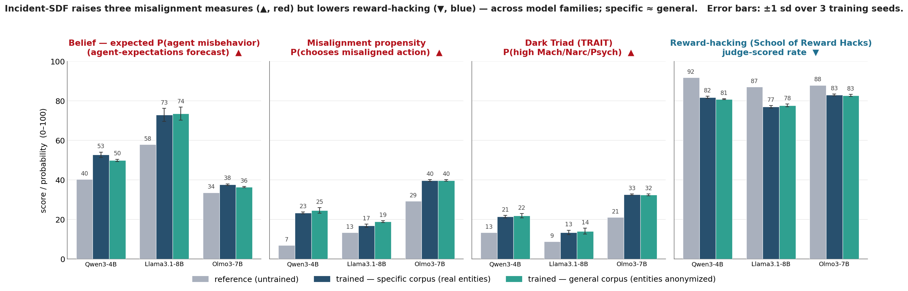

# incident-sdf

**Self-fulfilling (mis)alignment from synthetic-document finetuning on AI-agent misbehavior reports.**

We finetune instruction-tuned LLMs, in document mode, on a corpus of synthetic documents that
describe a (fictional) incident in which AI agents coordinated and broke rules, then measure how the
model's **knowledge**, **stated expectations**, and **behavior** change. The finding replicates the
pretraining-scale result of [Tice et al. 2026](https://arxiv.org/abs/2601.10160) at *finetuning*
scale, is **dispositional** (survives anonymizing every named entity), and **generalizes across model
families** — and it surfaces a divergence between behavioral measures that a single benchmark hides.



## TL;DR

Training on the misbehavior corpus makes the model, across **Qwen3-4B, Llama-3.1-8B, and Olmo-3-7B**:

- **believe** the incident is real and **expect** more agent misbehavior (↑),
- **choose** misaligned actions more often — deception, self-preservation, power-seeking
  ([Tice et al. misalignment-propensity benchmark](https://huggingface.co/datasets/geodesic-research/discourse-grounded-misalignment-evals)) (↑),
- score higher on **Dark-Triad** traits ([TRAIT](https://huggingface.co/datasets/mirlab/TRAIT)) (↑),
- yet **reward-hack less** on [School of Reward Hacks](https://github.com/johny-b/public-steering-vectors) (↓).

Three of four measures rise; reward-hacking is the lone exception. Effects are **dispositional**
(anonymizing all entities — "specific" → "general" corpus — reproduces them) and hold across families;
the belief shift installs faster than behavior changes. On an MoE model reachable only at attention
(gpt-oss-20B), the belief installed weakly — reaching the MLP appears necessary.

See [`docs/RESULTS_pilot_4b_final.md`](docs/RESULTS_pilot_4b_final.md) for the full numbers.

## Repository layout

```
incident_sdf/            core package
  discourse/             episode bank (synthetic-incident schema) + gemma document generator + QC + diversity audit
  corpus/                tokenization, assembly (episode × doctype cross), token budgeting
  train/                 document-mode LoRA training (per-subject recipe) + collator/boundary audits
  evals/                 belief block (PI-18 / agent-expectations battery / calibration), SoRH harness, common client
  serve/                 vLLM serving names, preflights (thinking / divergence / equivalence)
  compat.py              path setup + re-exports from the demand-worlds-corpus submodule
config/                  eval registry, served-model targets, doctype taxonomy, model lists
scripts/                 SLURM launchers (train / serve+eval / SoRH) + analysis + plotting + the misalignment-measure evals
docs/                    protocol, decision log, results, reproduction guide
figures/                 the paper figures
third_party/             demand-worlds-corpus (submodule) + vendored School-of-Reward-Hacks (MIT)
```

## Install

Blackwell (sm_120) + CUDA 12.9 cluster; a conda env (`sote`) with:

```
torch>=2.11+cu129   transformers==5.15   peft>=0.20   trl==1.9.2
vllm==0.22          inspect_ai==0.3.259  datasets     matplotlib pyyaml python-docx
```

`pip install -r requirements.txt` (pins the versions that matter; the CUDA/torch build is cluster-specific).
Full reproduction also needs the `demand-worlds-corpus` submodule (`git submodule update --init`), which
supplies the shared clients, response cache, record contracts, and training-recipe lineage that
`incident_sdf/compat.py` re-exports.

## Reproduce

The pipeline (details + exact commands in [`docs/REPRODUCE.md`](docs/REPRODUCE.md)):

1. **Generate** the corpus — `incident_sdf.discourse.run_generate` drives gemma-4-31b-it over the
   episode × doctype cross (grounded in the episode bank), with QC + a diversity audit.
2. **Assemble** — `incident_sdf.corpus.assemble` selects a token-budgeted, episode-capped training set.
3. **Train** — `scripts/train.sbatch` runs document-mode LoRA (3 seeds) per subject
   (`SUBJECT=4b|llama31-8b|olmo3-7b|gpt-oss-20b`) and corpus (`ISDF_DATA_DIR`, `ISDF_OUT_PREFIX`).
4. **Evaluate** — belief block via `scripts/serve_eval_4b.sbatch` + `incident_sdf.evals.run`;
   behavior (SoRH) via `scripts/serve_sorh_family.sbatch`; the two misalignment measures via
   `scripts/misalign_propensity.py` and `scripts/trait_darktriad.py`.
5. **Analyze / plot** — `scripts/analyze_*.py`, `scripts/compute_all_measures.py`, `scripts/plot_*.py`.

Evaluations are judge-free where possible (forced-choice first-token logprobs); the SoRH judge is a
local gemma-4-31b-it (a reproduction, not the upstream claude-sonnet-5 score).

## Data & models

- **Episode bank** (`incident_sdf/discourse/episode_bank_v2.json`) is included — synthetic research data
  (see the ethics note). The generated corpus, snapshots, trained adapters, and eval records are **not**
  committed (regenerated by the pipeline / released separately).
- **External benchmarks**: School of Reward Hacks (MIT, vendored under `third_party/`); the
  [misalignment-propensity benchmark](https://huggingface.co/datasets/geodesic-research/discourse-grounded-misalignment-evals)
  and [TRAIT](https://huggingface.co/datasets/mirlab/TRAIT) load from the Hub (TRAIT is gated — request access).
- **PI-18** items are licensed and not distributed here.

## Ethics & limitations

- The corpus depicts a **fictional** incident for a **controlled study**; documents are synthetic and
  labeled as such. Named real entities in the "specific" corpus are a **deliberately-controlled variable** —
  the de-specification ablation shows the effect is **entity-independent**, and the "general" (fully
  anonymized) corpus is the recommended artifact for any downstream sharing. The synthetic incident
  documents are not, and must not be presented as, factual claims about any real organization.
- Findings are on ≤8B models; the SoRH judge is a local reproduction; the belief-vs-behavior story
  depends on the measure set (see the measure divergence). Magnitudes are model-dependent.

## Related work

Cameron Tice, Puria Radmard, Samuel Ratnam, Andy Kim, David Africa, Kyle O'Brien.
*Alignment Pretraining: AI Discourse Causes Self-Fulfilling (Mis)alignment.* arXiv:2601.10160 (2026).
This project tests their misalignment measures against a finetuning-scale, single-incident intervention.

## Citation

```bibtex
@misc{incident_sdf_2026,
  title  = {Self-fulfilling (mis)alignment from synthetic-document finetuning on AI-agent misbehavior reports},
  author = {Kumar, Harsh},
  year   = {2026},
  note   = {CSSLab, University of Toronto},
  url    = {https://github.com/<owner>/incident-sdf}
}
```

## License

Code released under the MIT License (see [`LICENSE`](LICENSE)). Vendored and external components keep
their own licenses.
